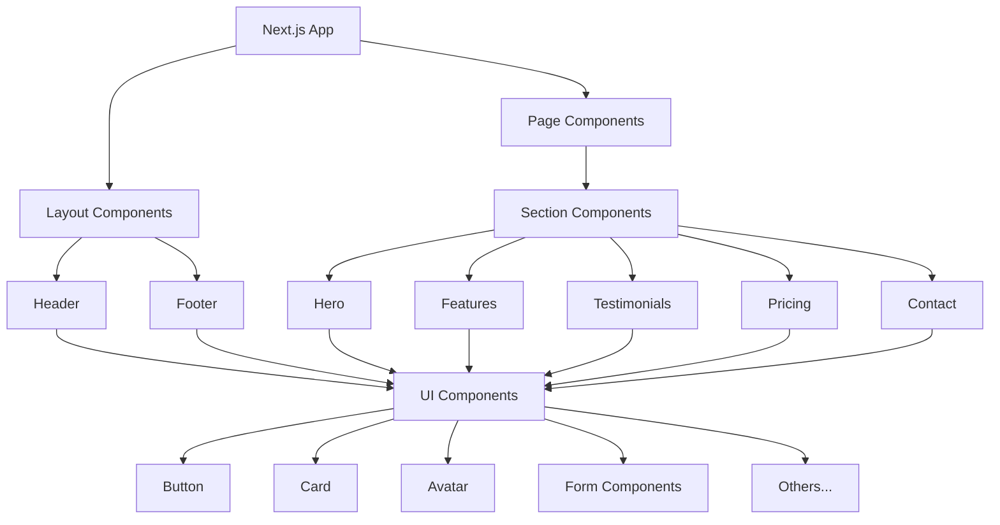

# System Patterns: JAMStack Website Template

## Architecture Overview
The JAMStack website template follows a component-based architecture, organized in a hierarchical structure that promotes reusability and separation of concerns.



## Component Structure
The project follows a modular component structure:

1. **Layout Components**: Components that form the shell of the application
   - Header: Navigation and branding
   - Footer: Site-wide links, copyright, social media
   
2. **Section Components**: Reusable page sections for landing pages
   - Hero: Main banner/introduction section
   - Features: Highlight product/service features
   - Testimonials: User reviews/testimonials
   - Pricing: Pricing plans/tiers
   - Contact: Contact form and information

3. **UI Components**: Building blocks from shadcn/ui
   - Button, Card, Avatar, Form Elements, etc.
   - Enhanced with Tailwind CSS for styling

## Design Patterns

### Component Composition
Components are built using composition, allowing for greater flexibility and reusability. Smaller UI components are combined to create larger section components.

```tsx
// Example of component composition
<Card>
  <CardHeader>
    <CardTitle>Title</CardTitle>
    <CardDescription>Description</CardDescription>
  </CardHeader>
  <CardContent>Content here</CardContent>
  <CardFooter>
    <Button>Action</Button>
  </CardFooter>
</Card>
```

### Prop Drilling Minimization
Components accept props for customization, but complex data management would be implemented using React Context or state management if needed.

### Responsive Design Pattern
The template uses a mobile-first approach with Tailwind CSS breakpoints:
- Default styles for mobile devices
- `sm:` prefix for small screens (640px and above)
- `md:` prefix for medium screens (768px and above)
- `lg:` prefix for large screens (1024px and above)

### Naming Conventions
- Component files: PascalCase (e.g., `Header.tsx`, `FeatureCard.tsx`)
- Utility files: camelCase (e.g., `utils.ts`)
- CSS class naming: Tailwind classes for styling

## File Structure

```
src/
├── app/                    # Next.js App Router files
│   ├── layout.tsx          # Root layout with metadata
│   ├── page.tsx            # Home page
│   └── globals.css         # Global styles
├── components/             # React components
│   ├── layout/             # Layout components
│   │   ├── Header.tsx
│   │   └── Footer.tsx
│   ├── sections/           # Page sections
│   │   ├── Hero.tsx
│   │   ├── Features.tsx
│   │   ├── Testimonials.tsx
│   │   ├── Pricing.tsx
│   │   └── Contact.tsx
│   └── ui/                 # shadcn UI components
│       ├── button.tsx
│       ├── card.tsx
│       └── ...
└── lib/                    # Utility functions
    └── utils.ts            # Helper functions
```

## Technical Decisions

1. **TypeScript**: Enforces type safety and improves developer experience
2. **Next.js App Router**: Provides file-based routing and modern React features
3. **Tailwind CSS**: Utility-first CSS framework for rapid styling
4. **shadcn/ui**: High-quality, customizable UI components
5. **Mobile-First Design**: Ensures responsive behavior across devices

## Performance Considerations

- Next.js optimizes rendering with server components and static generation
- Images are optimized using Next.js Image component
- Code splitting enabled by default with Next.js
- Minimal dependencies to reduce bundle size
- CSS optimized with Tailwind's JIT compiler
